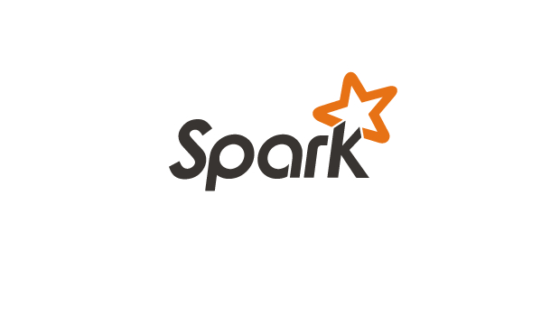

# Apache Spark Kinesis Consumer

> Example project for consuming AWS Kinesis streamming and save data on Amazon Redshift using Apache Spark

Code from: [Processing IoT realtime data - Medium](https://medium.com/@iamvsouza/processing-grandparents-realtime-data-d6b8c99e0b43)

<p align="center">
  
</p>


## Usage example

You need to set Amazon Credentials on your enviroment.

```shell
export AWS_ACCESS_KEY_ID=""
export AWS_ACCESS_KEY=""
export AWS_SECRET_ACCESS_KEY=""
export AWS_SECRET_KEY=""
```

## Dependencies

Must be included on `--packages` flag.

`org.apache.spark:spark-streaming-kinesis-asl_2.10:1.6.1`

## Setup

__How run Kinesis locally?__

A few months ago I created a Docker image with Kinesalite (amazin project to simulate Amazon Kinesis), you can use
this image, or run [Kinesalite]() directly.

`docker run -d -p 4567:4567 vsouza/kinesis-local -p 4567 --createStreaMs 5`

see the [project](https://github.com/vsouza/docker-Kinesis-local)

__I should have DynamoDB too?__

Yes, :cry: . The AWS SDK Kinesis module make checkpoints of your Kinesis tunnel, and store this on DynamoDB. You don't
need to create tables or else, the SDK will create for you. 

*Remeber to configure your  throughput of DynamoDB correctly*

## License

[MIT License](http://vsouza.mit-license.org/) © Vinicius Souza
